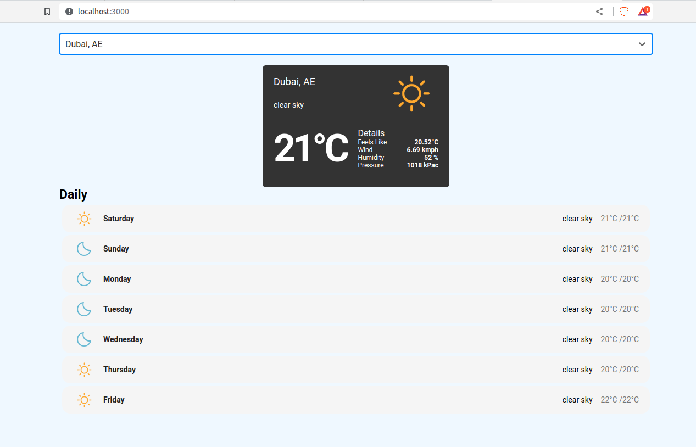

### Current Weather App 



```
Displays Current weather and forecast of the weather for a city
```
#### How to set up this project

### Pull the source code

If pulled for the first time or the package.json changed run

```docker-compose build```

Then, run the following command to start the environment.

```docker-compose up -d```

### To see the logs of your app

```docker-compose logs -f web```

### To see and follow the logs of your tests

```docker-compose logs -f test```


### stop the containers

```docker-compose down```
